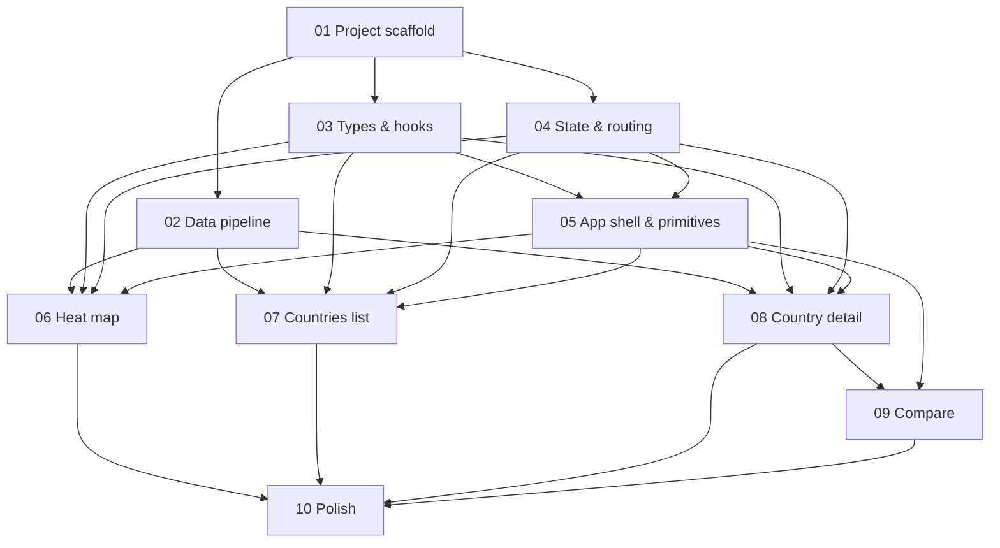

# Implementation Timeline — Waves & Dependency Graph

This document defines the order in which the specs in `specs/` should be implemented and which can run in parallel. Each "wave" lists specs that may execute concurrently (different agents / branches). A spec only starts once **all** of its dependencies are complete.

## Per-spec dependency table

| Spec | Title | Depends on | Can parallelize with |
|------|-------|------------|----------------------|
| 01 | Project scaffold | — | — (root) |
| 02 | Data pipeline | 01 | 03, 04 |
| 03 | Data types & hooks | 01 | 02, 04 |
| 04 | Global state & routing | 01 | 02, 03 |
| 05 | App shell & UI primitives | 01, 03, 04 | 02 |
| 06 | Heat map | 01, 02, 03, 04, 05 | 07, 08 |
| 07 | Countries list | 01, 02, 03, 04, 05 | 06, 08 |
| 08 | Country detail | 01, 02, 03, 04, 05 | 06, 07 |
| 09 | Compare | 01, 02, 03, 04, 05, 08 | — (single-spec wave) |
| 10 | Polish | 01–09 | — (single-spec wave) |

## Waves

### Wave 1 — Foundation (sequential start)

- **Spec 01 — Project scaffold** *(solo)*

Nothing else can begin until install/test/lint commands exist.

### Wave 2 — Parallel foundation (3 tracks)

Run all three concurrently after spec 01 lands:

- **Spec 02 — Data pipeline** *(track A: data engineering)*
- **Spec 03 — Data types & hooks** *(track B: typed client data layer; can use fixtures while 02 is in flight)*
- **Spec 04 — Global state & routing** *(track C: Zustand + react-router placeholders)*

Specs 03 and 04 share spec 03's constants but spec 04 only needs the type/constant exports — agents can coordinate via a tiny stub `src/data/types.ts` checked in early.

### Wave 3 — Shell

- **Spec 05 — App shell & UI primitives** *(solo)*

Requires types (03) and routing (04). Acts as the choke point before feature work.

### Wave 4 — Features (3 parallel tracks)

All three feature pages can be built simultaneously by separate agents:

- **Spec 06 — Heat map** *(track A)*
- **Spec 07 — Countries list** *(track B)*
- **Spec 08 — Country detail** *(track C)*

Coordinate ahead of time: spec 08 should design `RadarBreakdown`, `CategoryBars`, and `TimeseriesChart` with prop shapes that generalize to multi-country (so spec 09 can extend rather than duplicate). If that contract is agreed in spec 08's PR description, no rework is needed in wave 5.

### Wave 5 — Compare

- **Spec 09 — Compare** *(solo)*

Reuses chart components from spec 08, so it must follow.

### Wave 6 — Polish

- **Spec 10 — Polish** *(solo)*

Final wave: search palette, responsive audit, dark mode, README.

## Dependency graph

## Critical path

`01 → 03 → 05 → 08 → 09 → 10`

Any speedups should target this chain. Spec 02 and spec 04 are not on the critical path; spec 06 and spec 07 are leaves until polish.

## Parallelization summary

- **Maximum useful parallelism**: 3 agents (waves 2 and 4).
- **Total waves**: 6.
- **Estimated minimum waves with single agent**: 10 (sequential).
- **Estimated minimum waves with 3 agents**: 6 — a ~40% reduction in elapsed time, assuming similar effort per spec.

## Coordination notes

- Before wave 2 starts, commit a stub `src/data/types.ts` containing only the constants (`MIN_YEAR`, `MAX_YEAR`, `DEFAULT_YEAR`, `MetricKey` literal union, `Region` literal union). This unblocks spec 04 from blocking on spec 03's full implementation.
- Before wave 4 starts, agree the multi-country prop contracts for radar/bars/timeseries components in spec 08's PR so spec 09 can extend without refactor.
- Each spec must follow the spec-driven + TDD workflow defined in `AGENTS.md`: failing tests first, then implementation; spec edits land before implementation when scope shifts.
